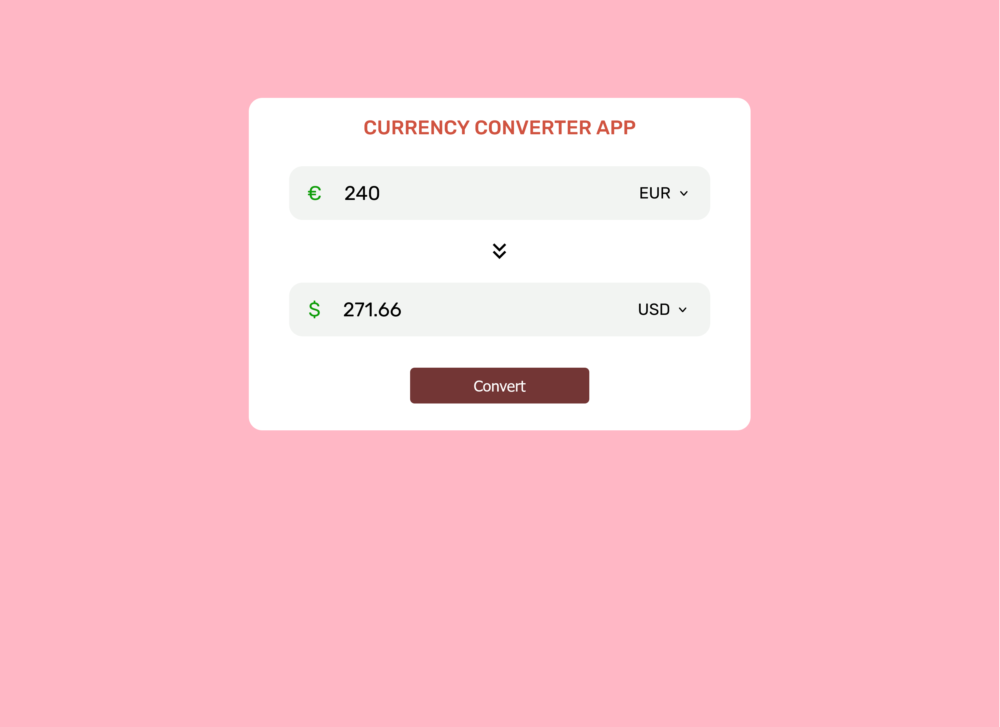

# Currency Converter

## Description
 This is a simple currency converter application. It prepard using React. There is a currency converter and it is includes two inputs.
 We enter the value we want to convert into the first input. When we click the convert button, the converted version of the value we entered comes
 to the second input. And there are currency symbols that change depending on the currency we select.

 


 ## Demo
 [Live Demo](https://meek-empanada-a6444f.netlify.app/)

 ##Technologies Used

 - React
 - Vite
 - Axios
 - FreeCurrencyAPI
 - React Icons
 - CSS


 ## Features

 - Real-time currency conversion
 - Displayin currency symbols
 - Responsive design


 ## What I Learned
 - How to fetch data using Axios in React
 - Working with React hooks (useState)
 - Using environment variables for API key security
 - Designing responsive UI with CSS


 ## Setup
 To run this project locally:

 ```bash
 git clone https://github.com/Rumeysa-koseoglu/currency-converter
 cd currency-converter
 npm install
 npm run dev
 ```